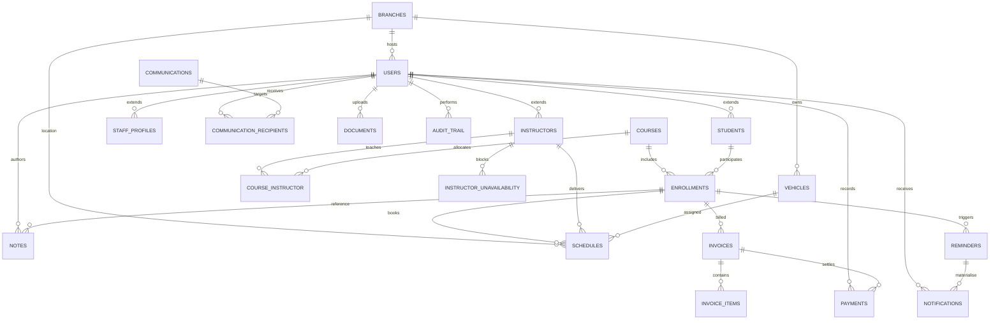

# Database Design

## 1. Overview
The Origin Driving School Management System persists data in a normalised MySQL schema using the InnoDB engine and UTF8MB4 character set. All tables use unsigned auto-incrementing integer primary keys and enforce referential integrity through foreign keys. Application-layer data access is mediated via PDO prepared statements.

## 2. Naming Conventions
- Table names are lowercase snake_case and plural (e.g., `students`).
- Foreign key columns follow `{entity}_id` naming (e.g., `student_id`).
- Timestamps stored in UTC as `DATETIME`.
- Enumerations implemented with `ENUM` and mirrored in validation helpers.

## 3. Crow's Foot ER Diagram


> **Note:** Mermaid's `erDiagram` syntax uses crow's foot-style connectors to communicate cardinalities (|| for one, } for many). The relationships above align with the data dictionary described below.

## 4. Entity Catalogue

### 4.1 Core Identity Tables
- **`users`** — Master record for all personas (admin, staff, instructor, student). Columns: role, first/last name, email (unique), phone, password_hash, status (`active`/`archived`), branch_id, timestamps.
- **`students`** — Extends users with licence metadata, emergency contacts, address, progress summary.
- **`instructors`** — Extends users with accreditation, experience years, availability notes, biography, rating.
- **`staff_profiles`** — Extends users with position title, employment type, start date, branch assignment.

### 4.2 Academic Structure
- **`branches`** — Physical school locations with contact information.
- **`courses`** — Driving programs with pricing, lesson count, status (`active`/`inactive`).
- **`course_instructor`** — Junction table mapping instructors to courses.
- **`enrollments`** — Links students to courses; tracks start date, status (`active`, `in_progress`, `completed`, `cancelled`), progress percentage, notes.
- **`enrollment_requests`** — Captures intake submissions with preferred schedule, instructor preference, approval metadata.

### 4.3 Scheduling & Delivery
- **`schedules`** — Lesson/exam bookings referencing enrollment, instructor, vehicle, branch; includes timing, status (`scheduled`, `completed`, `cancelled`, `not_completed`), topics, notes, completion metadata, reminder flag.
- **`instructor_unavailability`** — Blocks out instructor availability windows to prevent conflicting bookings.
- **`reminders`** — Pending reminder jobs (related_type `invoice`/`schedule`, recipient, channel `email`/`sms`/`in-app`, message, send_on, status `pending`/`sent`/`cancelled`).
- **`notifications`** — In-app alerts with title, message, level (`info`, `success`, `warning`, `danger`), read flag, timestamps.

### 4.4 Fleet & Compliance
- **`vehicles`** — Fleet registry including transmission, registration plate (unique), VIN, branch, maintenance dates, status (`available`, `in_service`, `maintenance`).
- **`documents`** — Uploaded attachments (user_id, file_name, file_path, mime_type, size, category, notes).

### 4.5 Finance
- **`invoices`** — Header details (invoice_number unique, enrollment_id, issue/due dates, subtotal, tax_amount, total, status `sent`/`partial`/`paid`/`overdue`, notes).
- **`invoice_items`** — Line items with description, quantity, unit_price, total.
- **`payments`** — Receipts (invoice_id, amount, payment_date, method, reference, notes, recorded_by user).

### 4.6 Communications & Audit
- **`communications`** — Broadcast messages (sender, audience_scope, channel `email`/`sms`/`in-app`, subject, message).
- **`communication_recipients`** — Normalised recipients (communication_id, user_id).
- **`notes`** — Free-form annotations tied to `student`/`instructor`/`staff` entities with author and timestamp.
- **`audit_trail`** — Immutable log of sensitive actions capturing user_id, entity_type, entity_id, action, details text, timestamp.

## 5. Referential Integrity Highlights
- `students.user_id`, `instructors.user_id`, `staff_profiles.user_id` cascade on delete; soft deletes handled through `users.status` to avoid orphaning.
- `enrollments` references both `students` and `courses`; cascade ensures dependent schedules, invoices, reminders are cleaned when enrolment removed.
- `schedules.vehicle_id` and `schedules.branch_id` nullable to support unassigned bookings; foreign keys set to `SET NULL` on delete.
- `payments.recorded_by` retains history even if staff member leaves (`SET NULL`).
- `notifications.user_id`, `documents.user_id`, and `communication_recipients.user_id` cascade to avoid orphan records.

## 6. Indexing Strategy
| Table | Index | Purpose |
| --- | --- | --- |
| `users` | `UNIQUE(email)` | Authentication lookup |
| `enrollment_requests` | `idx_request_status`, `idx_request_instructor` | Queue triage & instructor workload |
| `schedules` | `idx_schedule_date`, `idx_schedule_instructor` | Calendar views & conflict detection |
| `instructor_unavailability` | `idx_unavailability_instructor`, `idx_unavailability_window` | Availability checks |
| `reminders` | `idx_reminder_status_send` | Efficient reminder queue polling |

Additional indexes can be introduced for high-volume installations (e.g., `invoices.status`, `payments.invoice_id`).

## 7. Data Lifecycle & Retention
- **Active Records:** Students, enrollments, schedules retained for the learner lifecycle plus statutory retention.
- **Archival:** Completed enrollments older than 5 years exported to archival storage; reminders older than 12 months purged post-audit.
- **Deletion:** Hard deletes avoided; `users.status = 'archived'` disables accounts while preserving relationships.
- **Audit Trail:** Never deleted; optionally rotated into yearly partitions for performance.

## 8. Sample Queries
```sql
-- Fetch upcoming lessons for an instructor
SELECT s.*, st.first_name, st.last_name, v.name AS vehicle_name
FROM schedules s
JOIN enrollments e ON e.id = s.enrollment_id
JOIN students st ON st.id = e.student_id
LEFT JOIN vehicles v ON v.id = s.vehicle_id
WHERE s.instructor_id = :instructorId
  AND s.scheduled_date BETWEEN CURDATE() AND DATE_ADD(CURDATE(), INTERVAL 14 DAY)
ORDER BY s.scheduled_date, s.start_time;

-- Calculate outstanding balance per student
SELECT u.id AS user_id, u.first_name, u.last_name,
       SUM(i.total) - COALESCE(SUM(p.amount), 0) AS balance
FROM invoices i
JOIN enrollments e ON e.id = i.enrollment_id
JOIN students s ON s.id = e.student_id
JOIN users u ON u.id = s.user_id
LEFT JOIN payments p ON p.invoice_id = i.id
WHERE i.status IN ('sent','partial','overdue')
GROUP BY u.id, u.first_name, u.last_name;
```

## 9. Data Access Layer Mapping
- Each table has a corresponding DAO in `app/Models` encapsulating CRUD operations and domain-specific queries (e.g., `ScheduleModel::forInstructor`, `InvoiceModel::forStudent`).
- Complex workflows (student onboarding, schedule creation, invoice settlement) orchestrate multiple DAOs within transactions initiated by controllers.
- SQL statements are centralised inside models, simplifying maintenance, security reviews, and reuse across controllers.

## 10. Future Enhancements
- Materialised reporting tables (monthly revenue snapshots, instructor utilisation) for faster dashboards.
- Optional `vehicle_service_logs` child table to track maintenance history in more detail.
- JSON column for `communications` to store templated payload metadata and delivery receipts.
- Partition `audit_trail` by year to keep active table lean in high-volume deployments.

Refer to [`sql/database.sql`](../sql/database.sql) for the authoritative schema definition and seed data.
