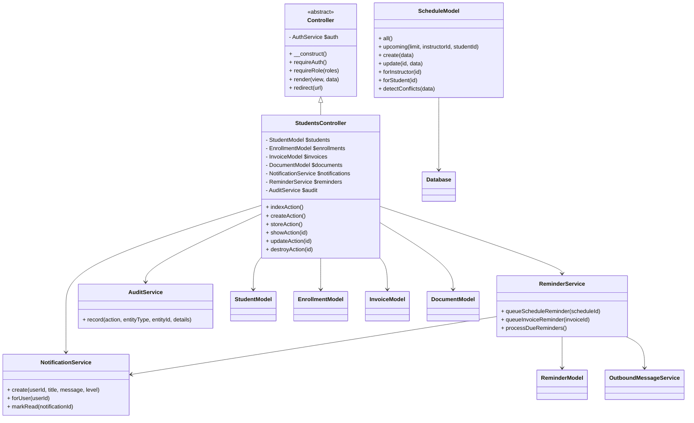

# Diagram Catalogue

This document consolidates the primary diagrams describing the Origin Driving School Management System. All diagrams are rendered using [Mermaid](https://mermaid.js.org/) syntax for maintainability.

## 1. Use Case Diagram
```mermaid
usecaseDiagram
  actor Admin as "Administrator"
  actor Staff as "Operations Staff"
  actor Instructor
  actor Student

  Admin -- (Manage Branches)
  Admin -- (Configure Courses)
  Admin -- (View Organisation KPIs)
  Admin -- (Manage Staff Accounts)
  Admin -- (Audit Sensitive Actions)

  Staff -- (Onboard Student)
  Staff -- (Approve Enrolment Request)
  Staff -- (Schedule Lesson)
  Staff -- (Issue Invoice)
  Staff -- (Record Payment)
  Staff -- (Send Broadcast Communication)
  Staff -- (Upload Document)

  Instructor -- (View Assigned Schedule)
  Instructor -- (Submit Availability)
  Instructor -- (Record Lesson Outcome)
  Instructor -- (View Assigned Students)

  Student -- (Submit Enrolment Request)
  Student -- (View Lesson Schedule)
  Student -- (Review Invoice & Balance)
  Student -- (Upload Identification Document)
  Student -- (Receive Notifications)
```

## 2. Logical Component Diagram
```mermaid
flowchart LR
  subgraph Presentation
    V[Views (PHP Templates)]
    JS[assets/js/app.js]
    CSS[assets/css/style.css]
  end

  subgraph Controllers
    AuthC[AuthController]
    StudentsC[StudentsController]
    SchedulesC[SchedulesController]
    InvoicesC[InvoicesController]
    DashboardC[DashboardController]
  end

  subgraph Services
    AuthS[AuthService]
    ReminderS[ReminderService]
    NotificationS[NotificationService]
    OutboundS[OutboundMessageService]
    AuditS[AuditService]
  end

  subgraph Models
    UserM[UserModel]
    StudentM[StudentModel]
    EnrollmentM[EnrollmentModel]
    ScheduleM[ScheduleModel]
    InvoiceM[InvoiceModel]
    ReminderM[ReminderModel]
    NotificationM[NotificationModel]
    CommunicationM[CommunicationModel]
  end

  DB[(MySQL Database)]
  Files[(Uploads / Logs)]

  V --> AuthC
  V --> StudentsC
  V --> SchedulesC
  V --> InvoicesC
  V --> DashboardC
  JS --> SchedulesC
  CSS --> V
  AuthC --> AuthS
  StudentsC --> ReminderS
  StudentsC --> NotificationS
  StudentsC --> AuditS
  SchedulesC --> ReminderS
  SchedulesC --> AuditS
  InvoicesC --> NotificationS
  InvoicesC --> OutboundS
  InvoicesC --> AuditS
  DashboardC --> ReminderS
  AuthS --> UserM
  ReminderS --> ReminderM
  ReminderS --> NotificationS
  ReminderS --> OutboundS
  NotificationS --> NotificationM
  OutboundS --> Files
  AuditS --> AuditTrail[(audit_trail table)]
  StudentsC --> StudentM
  StudentsC --> EnrollmentM
  StudentsC --> ScheduleM
  StudentsC --> InvoiceM
  SchedulesC --> ScheduleM
  SchedulesC --> EnrollmentM
  InvoicesC --> InvoiceM
  Models --> DB

```

## 3. UML Class Diagram (Simplified)


## 4. Sequence Diagram — Schedule Creation


## 5. Activity Diagram — Invoice Settlement


## 6. Deployment Diagram


## 7. Data Flow Diagram (Context Level)


These diagrams should be reviewed alongside the textual descriptions in [`architecture.md`](architecture.md) and [`system-overview.md`](system-overview.md) for full context.
